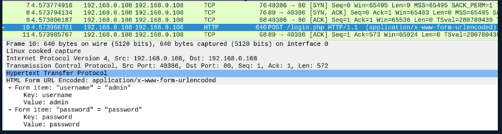
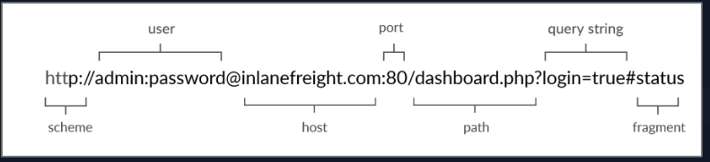
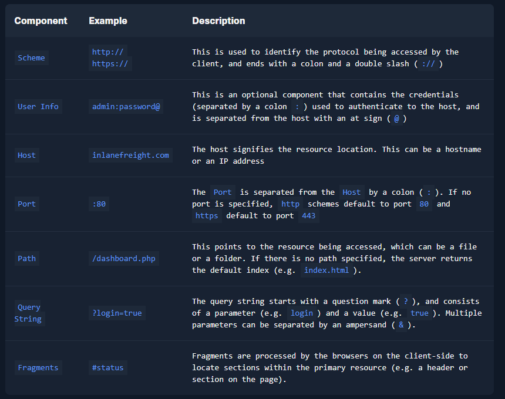
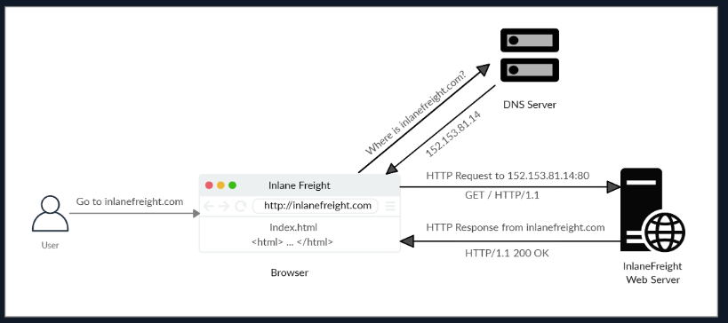
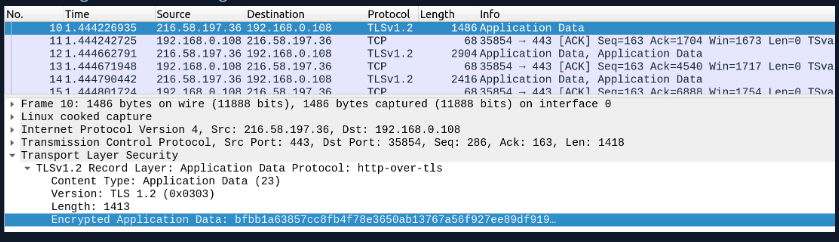
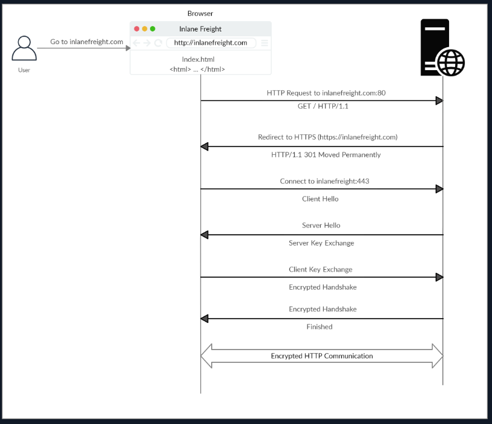

# Web Requests Module

## HTTP
HTTP also known as HyperText Transfer Protocol.
HTTP = application level protocol

HTTP communication = a client and a server
Default port: 80

Sends all data in clear text, MiTM (Man in the middle) attacks possible against HTTP.

Fully Qualified Domain Name (FQDN) as a Uniform Resource Locator (URL) -> reach website
www.domainname.com

### Flow of HTTP

**Note:** Our browsers usually first look up records in the local '/etc/hosts' file, and if the requested domain does not exist within it, then they would contact other DNS servers. We can use the '/etc/hosts' to manually add records to for DNS resolution, by adding the IP followed by the domain name.

### cURL command
cURL, client URL - is a command line tool that sends web requests (HTTP), supports others protocols aswell.

Good for scripts

Command: **curl <name_of_domain>**

Output: raw format

Can use cURL to download page or a file.
Print output to a file, use flag **-O**.
Specify file name, use flag **-o**.

Command: **curl -O <name_of_domain>**
Output: <root_index_file_of_domain.html>, example: index.html

Command: **curl -o <name_of_output_file> <name_of_domain>**
Output: <name_of_output_file>

When downloading the website, u will see status in the cmd, this can be removed.
Silent status of output with flag **-s**.

Command: **curl -s -O <name_of_domain>**
Output: <root_index_file_of_domain.html>, example: index.html - without status process while downloading website

To see more options for curl
Command: **curl -h**
Output: Lists out all options u can use

Skip certificate check
Command: **curl -k <name_of_domain>**

### Question 1
To get the flag, start the above exercise, then use cURL to download the file returned by '/download.php' in the server shown above.

Use command: **curl -o flag <target_ip:portnumber>/download.php**.

Remember that by default curl will curl the port 80, if not specified, hence u need to add the port number to the ipv4. Make it a habit to specify port number either by using *https://<ip_address>* or *<ip_address:portnumber>*.

Then u can **cat file** to see the content of the downloaded page.

Voila, there's the flag.

## HTTPS
HTTPS = Hypertext Transfer Protocol Secure

Data transfered in encrypted format.

Note: Although the data transferred through the HTTPS protocol may be encrypted, the request may still reveal the visited URL if it contacted a clear-text DNS server. For this reason, it is recommended to utilize encrypted DNS servers (e.g. 8.8.8.8 or 1.1.1.1), or utilize a VPN service to ensure all traffic is properly encrypted.

### Flow of HTTPS

Note: Depending on the circumstances, an attacker may be able to perform an HTTP downgrade attack, which downgrades HTTPS communication to HTTP, making the data transferred in clear-text. This is done by setting up a Man-In-The-Middle (MITM) proxy to transfer all traffic through the attacker's host without the user's knowledge. However, most modern browsers, servers, and web applications protect against this attack.

