# Windows Command Line
This module is all about learning how to use CMD and PowerShell.

# CMD
The next chapters are about the Command Prompt, afterwards we will take a look at Powershell.
## Command Prompt Basics

Insecure and not recommended:
- Telnet

Better optionals:
- Secure Shell (SSH) 
- PsExec
- WinRM
- RDP

### Case study: Windows Recovery
In the event of a user lockout or some technical issue preventing/ inhibiting regular use of the machine, booting from a Windows installation disc gives us the option to boot to Repair Mode. From here, the user is provided access to a Command Prompt, allowing for command-line-based troubleshooting of the device.

Accessing the Command Prompt via Recovery Mode

While useful, this also poses a potential risk. For example, on this Windows 7 machine, we can use the recovery Command Prompt to tamper with the filesystem. Specifically, replacing the Sticky Keys (sethc.exe) binary with another copy of cmd.exe

Once the machine is rebooted, we can press Shift five times on the Windows login screen to invoke Sticky Keys. Since the executable has been overwritten, what we get instead is another Command Prompt - this time with NT AUTHORITY\SYSTEM permissions. We have bypassed any authentication and now have access to the machine as the super user.

### Question 1
In what directory can the cmd executable be found? (just the folder name as answer)

First we will connect to the target machine by using the following command: ssh htb-student@{IP_ADDRESS}

As you open up the session, you will notice a path in the top of the command line console.

The answer is "system32".

## Getting Help

### Commands:
help
help {COMMAND}
{COMMAND} /?
cls

Command history can be looked at by moving keys up and down, page up, page down and also the command "doskey /history". And if working on a physical Windows host, you can use the function key to interact with session history.

Interrupting commands use Control + C

F3	Will retype the entire previous entry to our prompt.
F5	Pressing F5 multiple times will allow you to cycle through previous commands.
F7	Opens an interactive list of previous commands.
F9	Enters a command to our prompt based on the number specified. The number corresponds to the commands place in our history.

### Question 1
If I wanted to view the help documentation for 'ipconfig', what command and/or modifier would I use? (full command string)

The answer is "ipconfig /?".

### Question 2
What CLI equivalent "Help utility" exists on Linux hosts? (one word)

The answer is "man".

### Question 3
Which CMD hotkey will open an interactive list of the previous commands we have ran?

The answer is "F7".

## System Navigation  
Absolute path - considered the absolute path when it follows the complete structure of the file system starting from the root directory
Example: C:\Users\htb\Downloads

Relative path - using our working directory as the starting point to reference directories either above it or below it in the file system hierarchy.
Example: cd .\Downloads - if your current working directory is C:\Users\htb and we want to change to a directory below our current directory

Move up hierarchy use cd ..\, each ..\ represents a directory, meaning u can be in the Downloads folder and move up to the C folder by simply using the following command: cd ..\..\..\

### Commands:
dir - listing of the directory we are currently working in
cd - our current working directory
chdir
tree - listing the file structure
tree /F - listing the file structure with files and directory

### Interesting Directories
#### Name:	Location:	Description:

%SYSTEMROOT%\Temp	C:\Windows\Temp	    Global directory containing temporary system files accessible to all users on the system. All users, regardless of authority, are provided full read, write, and execute permissions in this directory. Useful for dropping files as a low-privilege user on the system.

%TEMP%	    C:\Users\<user>\AppData\Local\Temp	    Local directory containing a user's temporary files accessible only to the user account that it is attached to. Provides full ownership to the user that owns this folder. Useful when the attacker gains control of a local/domain joined user account.

%PUBLIC%	C:\Users\Public	    Publicly accessible directory allowing any interactive logon account full access to read, write, modify, execute, etc., files and subfolders within the directory. Alternative to the global Windows Temp Directory as it's less likely to be monitored for suspicious activity.

%ProgramFiles%	    C:\Program Files	    folder containing all 64-bit applications installed on the system. Useful for seeing what kind of applications are installed on the target system.

%ProgramFiles(x86)%	    C:\Program Files (x86)	    Folder containing all 32-bit applications installed on the system. Useful for seeing what kind of applications are installed on the target system.

### Question 1
What command will give us a listing of all files and folders in a specified path?

The answer is "tree /F".

### Question 2
What command will print my current working directory onto the console?

The answer is "cd".

## Working with Directories and Files - CMD

### Commands:
md - make new directory
mkdir - make new directory
rd - delete directory
rmdir - delete directory
rd /S - to delete directory and it's content
rmdir /S - to delete directory and it's content
move - move directory and its content from source to destination
xcopy - copies directory and content from source to destination
xcopy {PATH_TO_SOURCE_FOLDER} {PATH_TO_DESTINATION_FOLDER} /E - The /E copies any files and subdirectories to include empty directories, xcopy will reset any attribute the file had. If you want to retain the file's attributes (such as read-only or hidden), u can use /K.

#### xcopy note:
From a hacker's perspective, xcopy can be extremely helpful. If we wish to move a file, even a system file, or something locked, xcopy can do this without adding other tools to the host. As a defender, this is a great way to grab a copy of a file and retain the same state for analysis. For example, you wish to grab a read-only file that was transferred in from a CD or flash drive, and you now suspect it of performing suspicious actions.

robocopy - Robocopy can copy and move files locally, to different drives, and even across a network while retaining the file data and attributes to include timestamps, ownership, ACLs, and any flags set like hidden or read-only

#### robocopy note:
Robocopy can also work with system, read-only, and hidden files. As a user, this can be problematic if we do not have the SeBackupPrivilege and auditing privilege attributes. This could stop us from duplicating or moving files and directories. There is a bit of a workaround, however. We can utilize the /MIR switch to permit ourselves to copy the files we need temporarily.
 
more - view content of a file
more /S - blank space will be downgraded to a single line for easier readability
openfiles
type
echo
fsutil
ren
rename
replace
\> - create file if it doesnt exist or overwrite file if it does
\>> - append to a file
< - pass a for example a text file into a command (find /i "see" < test.txt)
| - pipeline
& - issue command and follow it with another command (ping 8.8.8.8 & type test.txt)
&& - AND
|| - OR
del
erase

#### del/erase note:
if you want to delete a read-only or hidden file, you can use the /A: switch.
To delete read-only file /A:R

u can use the dir /A:R to show all files with Read-only attribute.

removing file: del /A:H * - * is any file
del /F - to force deletion of a directory

copy - copying files from source to destination
copy /V - valdiation that it worked

### Question 1
What command can display the contents of a file and redirect the contents of the file into another file or to the console?

The answer is "type".

### Question 2
What command can be used to make the 'apples' directory? (full command as answer, not the alias)

The answer is "mkdir apples".

## Gathering System Information

Gathering system information aka host enumeration

The goal of host enumeration is to provide a overall picture of the target host, its environment, and how it interacts with other systems across the network.

The first question to ask ourselves is: "How do we know what to look for?"

To answer this question, we need to have a basic understanding of all the different types of information available to us on a system.

During enumeration, ask yourselves these questions:
- What system information can we pull from our target host?
- What other system(s) is our target host interacting with over the network?
- What user account(s) do we have access to, and what information is accessible from the account(s)?

Gathering all the information we can on a system or environment should be prioritized over exploiting the system, to avoid writing the system off as not vulnerable or completetly patched. Take your time gathering all the info needed.

### How to get this information?

#### Casting a Wide Net
Use the command **systeminfo** to find information about the host, such as hostname, IP address(es), domain, hotfixes that have been installed and much more. This is valuable information for a sysadmin when trying to diagnose issues.

For a hacker, this a good way to get a lay of the land while leaving a minimal footprint. Running one command is always better than running multiple commands to get the same information. We are less likely to be detected this way. Gathering information about OS version, hotfixes installed and OS build version can quickly help us determine if the host is vulnerable to an exploit through a Google or ExploitDB search.

#### Systeminfo Output
It's not a good idea to only know one way to gather information, escpially if they are monitored or tracked more closely. That is why we need multiple ways to gather the required information while staying under the radar.

#### Examining the System
If you need to retrieve some basic system information such as hostname or OS version, you can use the commands **hostname** and **ver**.

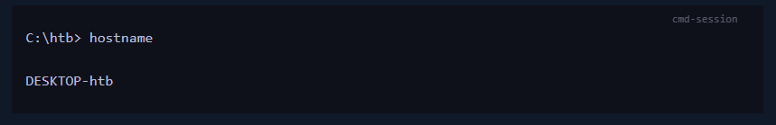
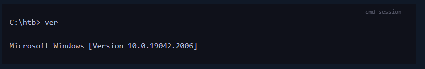

#### Scoping the Network
You can use the command **ipconfig** to gather information about some basic networking information of our target. This will help us understand how our target is connected and what devices it can access across the network - this is a invaluable tool in our arsenal as an attacker. The ipconfig command displays all current TCP/IP network configurations for the machine.

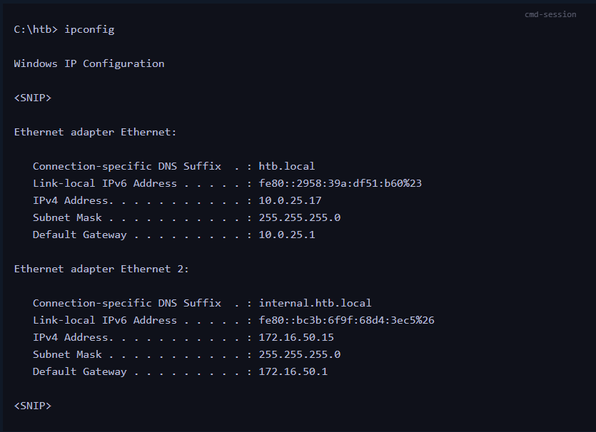

If you use Ipconfig without parameters, we get network information such as Domain Name, IPv4 Address, Subnet Mask and Default Gateway.
By using **ipconfig /all** it will provide us with a fully comprehensive listing of every network adapter attached to the system and additional information, including the physical address of each adapter (MAC Address), DHCP settings and DNS servers.

If you need information about what hosts our target has come into contact with, use the command **arp**.
Arp displays the contents and entries contained within the Address Resolution Protocol (ARP) cache. You can also use this command to modifiy the table entries. 

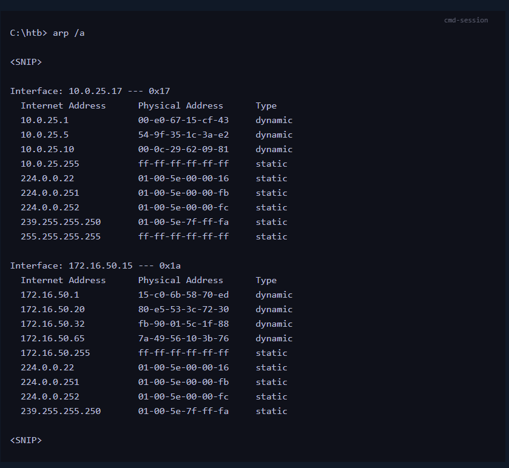

#### Understanding Our Current User
To figure out your current user, command **whoami**.

Whoami displays user, group and privilege information for the current logged in user.

The output of this command is the current domain and user named of the logged in account. Note: If the current user is not a domain-joined account, the NetBIOS name will be provided instead.
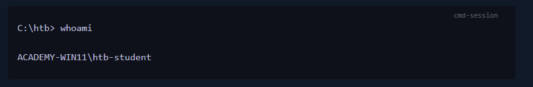

To check for the user's security privileges on the system, the command **whoami /priv** can be used. This is a set of basic permissions, but if there is any misconfigurations here, that could be used to escalate priviledges.

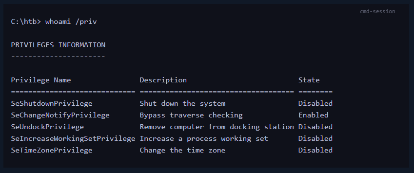

You can also check what groups the account is member of by using the command **whoami /groups**. This can provide information about what groups the account is part of, default groups and more importantly custom groups which the user have access to.

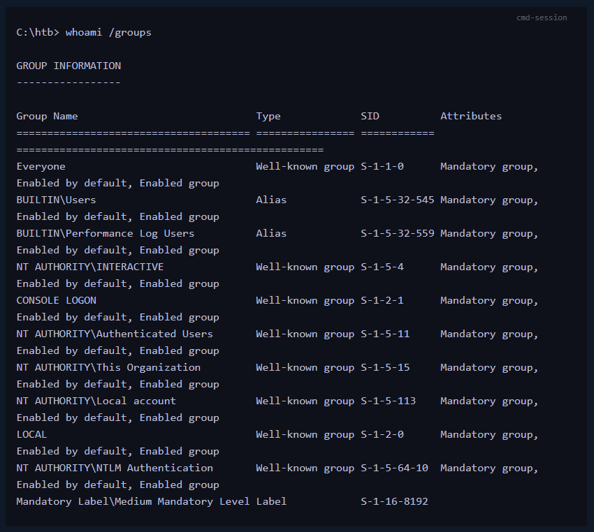

Command **whoami /all** can also be used to provide alot more information, like user, groups and priviledges.

#### Investigating Other Users/Groups
Most environments have machines that are on domain-joined networks, which means that anyone can log into any physical host on the network without requiring a local account on the machine. We can use this to our advantage to scope out what users have accessed our current host to see if we could access other accounts. We can use the command **net** to do this.

Net user allows us to display a list of all users on a host, information on a specific user and to create or delete users.

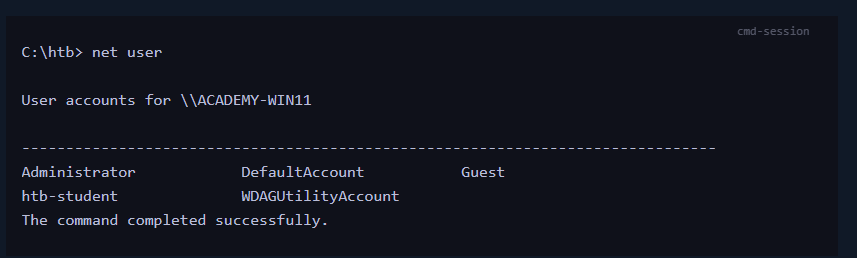

We can also look at what groups exist across the network by using commands **net group** or **net localgroup**.
Net group will display any groups that exist on the host from which we issued the command, create and delete groups and add or remove users from groups. It will also display domain group information if the host is joined to the domain. Net group must be run against a domain server such as the DC, while net localgroup can be run against any host to show us the groups it contains.

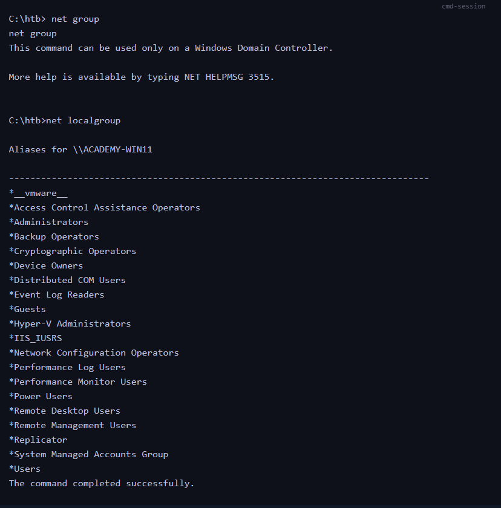

#### Exploring Resources on the Network
You can also gather information about the shares on a server that the user has access to and keep yourself able to log in again if you lose an established connection.

The command **net share** allows us to display info about the shared resources on the host and to create new shared resources.

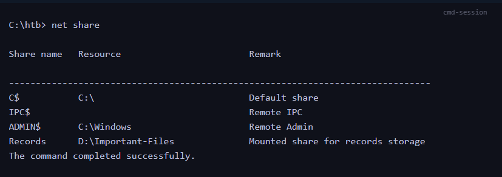

In the picture above you can see a share named Records, this can be potentially intersting informatioon for us to enumerate. If you do find a share like this we need to keep track of the following:
- Do we have the proper permissions to access this share?
- Can we read, write, and execute files on the share?
- Is there any valuable data on the share?

Shares are also good for hosting anything and lateral movement across hosts, if you need to be sneaky, you can drop a payload onto the share to enable movement around other hosts on the network.

If you don't need to look at shares but wish to search the environment broadly, use command **net view**.
Net view will display any shared resources the host you are issuing the command against knows of. This includes domain resources, shares, printers and more.

#### Piecing Things Together
Now you know  how to extracts tons of information, but keep in mind that this is quite noisy, and will most likely be noticed by anyone semi-competent. As it stands, we are writing tons of logs, leaving traces across multiple hosts and have little to no insight into what their Endpoint Dectection and Response (EDR) and Network Intrustion Detection System (NIDS) are able to see.

Note: cmd-prompt in a standard environment is not a common thing for a regular user. Administrators somtimes have reasons to use it, but it will be very suspicious if a average user is executing cmd.exe. With that in mind, using *net \** commands within an environment is not a normal thing either, and can be one way to alert on potential infiltration of a networked host easily. With proper monitoring and logging enabled, we should spot these actions quickly and use them to triage an incident before it gets too far out of hand.

### Question 1
What command will output verbose system information such as OS configuration, security info, hardware info, and more?

The answer is "systeminfo".

### Question 2
Access the target host and run the 'hostname' command. What is the hostname?

The answer is "ICL-WIN11".

## Finding Files and Directories

### Where Command
Command **where** can search for files in our environment variable path. If you use *where calc.exe* it will show us the path to where the file is, however it only works because calc.exe is in our environment path. If you are looking for a file that is not in the environment path, you can use the prefix */R*, this prefix will specify which directory to search for and will dig through all directories within that path.

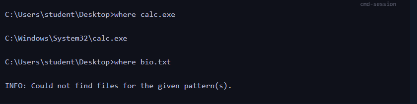

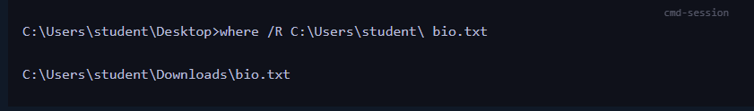

Can also use wildcard *\** when searching.

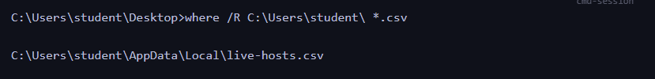

### Find Command
The command **find** is used to search for text strings within a file or files. You can also pipeline the output in terminal to use find, but the command is limited to when it comes to using wildcard patterns in its matching. 

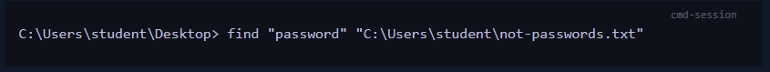

Prefix */V* - a NOT clause
Prefix */N* - display line numbers
Prefix */I* - ignore case sensitivity

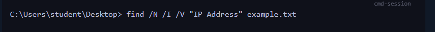

### Findstr Command
Is similiar to find command but it searches through files but for patterns instead. It will look for anything matching a pattern, regex value, wildcards and more. *Findstr == grep* command for Linux, kinda.

### Evaluating and Sorting Files

Commands **comp**, **fc** and **sort** can be used to evaluate files and compare them against each other.

### Comp Command
Comp will check each byte within two files looking for differences and then displays where they start. Showed by default in decimal format.
*/A* - to see in ASCII format
*/L* - provides line numbers

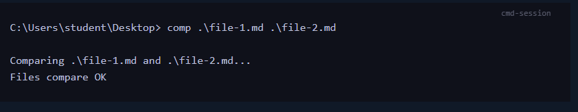

Can use comp command to see if files, scripts, executables have been modified.

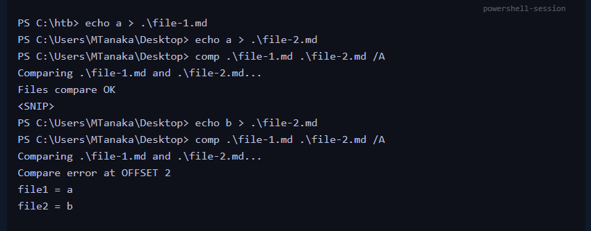

### FC Command
FC will show which lines are different, not just an individial character or byte that is different on each line.
*/N* - to see ASCII format and print the line numbers

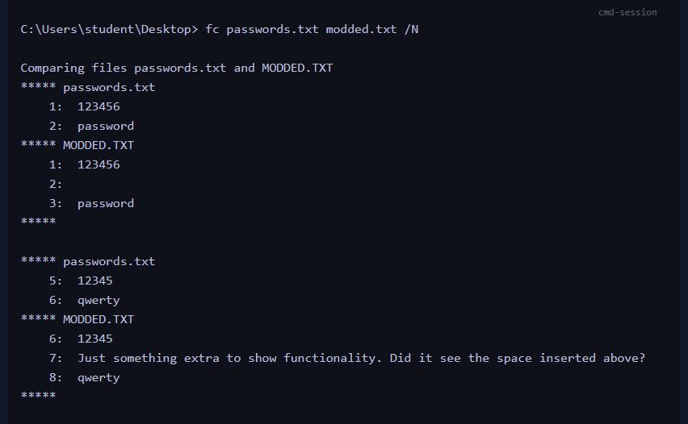

### Sort Command
It's important to sort files before comparing to make sure we actually spot the difference, otherwise the comparising will fail and tell us every single line is different.

Input: file, console, pipeline
Output: file, console or different command

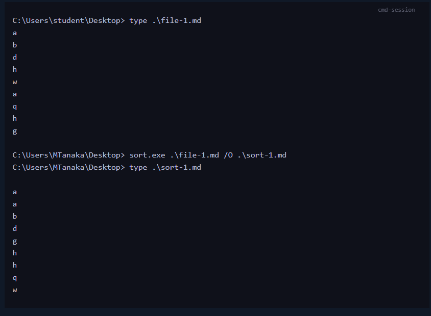

*/O* - Sending results to output
*/unique* - Removes duplicates

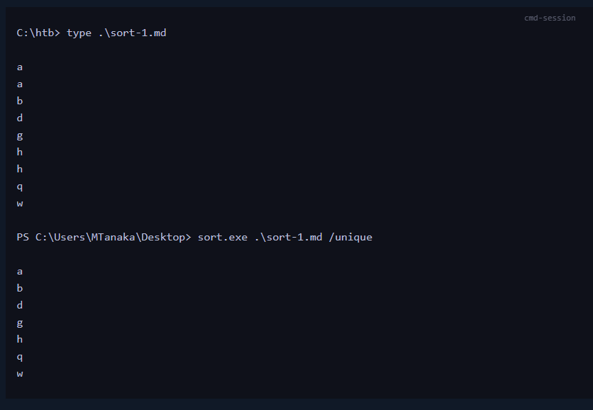

### Question 1
What command can be used to search for regular expression strings from command prompt?

The answer is "findstr".

### Question 2
Using the skills acquired in this and previous sections, access the target host and search for the file named 'waldo.txt'. Submit the flag found within the file.

To find this answer, first you need to know what command to use for finding files, since we have been good hackers and taken really good notes, you will remember that the command **where** is the one we will be using. 

First thing I try is **where waldo.txt**, and no output. Which means that the text file is not in the environmental path, so that means we gotta use the prefix /R to search through chosen directory and it's sub directories.

Next ill try the command **where /R C:\Users\ waldo.txt**, reason for this command is that most likely it's in one of the user folders and do not make any assupmtion that it might be on the *htb-student* , so I'll search all the user folders and voila. Found the file in the path: C:\Users\MTanaka\Favorites\waldo.txt

Next thing I would like to do is to find the content of the file, so I'll use the command **cat** to do so. Command used: **cat C:\Users\MTanaka\Favorites\waldo.txt**, and there we have the flag.

The answer is "RmxhZ3MgYXJlbid0IGhhcmQgdG8gZmluZCBub3csIHJpZ2h0Pw==".

## Environment Variables
Environment variables are settings that often applied globally to our hosts. Can be found on Windows, macOS and Linux hosts. Function differently on each OS. We use them for speeding up how application functions and reference data, to run scripts. On Windows host, environmental variables are NOT case sensitive, but can't start with an *=* or *number*. You call them like this:
**%I_AM_A_ENV_VAR%**

It's normal to see them as UPPERCASE letters and underscore to link each word (especially the built in ones).

### Variable Scope
Variable Scope
In this context, Scope is a programming concept that refers to where variables can be accessed or referenced. 'Scope' can be broadly separated into two categories:

#### Global:
Global variables are accessible globally. In this context, the global scope lets us know that we can access and reference the data stored inside the variable from anywhere within a program.
#### Local:
Local variables are only accessible within a local context. Local means that the data stored within these variables can only be accessed and referenced within the function or context in which it has been declared.

### Setting a local variable
Command **set <name_of_variable>=<content_of_variable>**

Example:
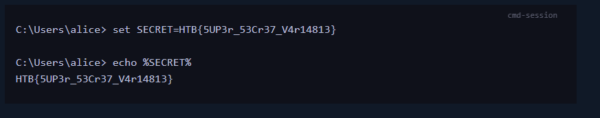

### Windows Environmental Variables
Windows envrionmental variables are defined into different scopes: System , User and Process. The Process scope is considered to be a subsystem of System and User scope.

=====================================================================================================================================================
**Scope	            Description	    Permissions Required to Access	    Registry Location**
=====================================================================================================================================================
System (Machine)	The System scope contains environment variables defined by the Operating System (OS) and are accessible globally by all users and accounts that log on to the system. The OS requires these variables to function properly and are loaded upon runtime.	                        

Local Administrator or Domain Administrator	        HKEY_LOCAL_MACHINE\SYSTEM\CurrentControlSet\Control\Session Manager\Environment
=====================================================================================================================================================
User	            The User scope contains environment variables defined by the currently active user and are only accessible to them, not other users who can log on to the same system.	

Current Active User, Local Administrator, or Domain Administrator	                    HKEY_CURRENT_USER\Environment

=====================================================================================================================================================
Process	            The Process scope contains environment variables that are defined and accessible in the context of the currently running process. Due to their transient nature, their lifetime only lasts for the currently running process in which they were initially defined. They also inherit variables from the System/User Scopes and the parent process that spawns it (only if it is a child process).	

Current Child Process, Parent Process, or Current Active User	                    None (Stored in Process Memory)
=====================================================================================================================================================

#### Displaying a environmental variable
You can use commands **set** and **echo** to view the environmental variable, by simply using the command and adding the name of the variable.

**set %PATH%** or **echo %PATH**

### Managing Environment Variables
Now that we have some way to view existing environment variables on our system, we need to be able to create, remove, and manage them from the comfort and safety of our prompt. We have two methods available to us to do so. We can either use set or setx to perform our intended actions.

#### When to Use set Vs. setx
Both **set** and **setx** are command line utilities that allow us to display, set, and remove environment variables. The difference lies in how they achieve those goals. The set utility only manipulates environment variables in the current command line session. This means that once we close our current session, any additions, removals, or changes will not be reflected the next time we open a command prompt. Suppose we need to make permanent changes to environment variables. In that case, we can use setx to make the appropriate changes to the registry, which will exist upon restart of our current command prompt session.

### Configure environmental variables

#### Setting variable
Setting variable with **set** command will be part of the **process** scope, so when your exit the cmd and start a new session it wont exists anymore.
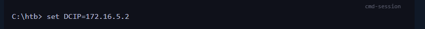

Setting variable with **setx** command, you gotta open a new cmd to see that the change have happened.
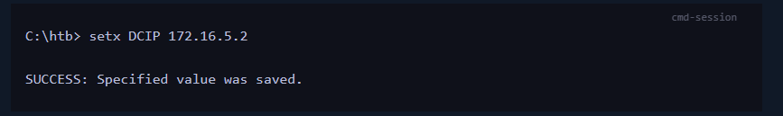

#### Editing variable
To **edit** existing variables, u simply use the commands (set and setx) to "overwrite" the variable.

#### Removing variable
Simply gotta overwrite these aswell with nothing, to make them be deleted.

Example: **setx SECRET ""**

### Important Environment Variables
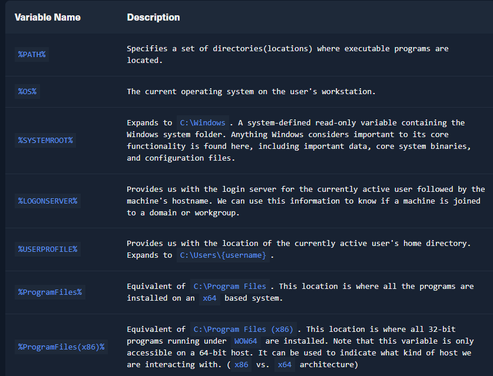

Complete list of variables: https://ss64.com/nt/syntax-variables.html

### Question 1
What variable scope allows for universal access?

The answer is "global".

## Managing Services
SC is a Windows executable utility that allows us to query, modify, and manage host services locally and over the network.

Being able to query services for information such as the process state, process id (pid), and service type is a valuable tool to have in our arsenal as an attacker. We can use this to check if certain services are running or check all existing services and drivers on the system for further information.

Checking which servies are currently actively running on the system.
Command: **sc query type= service** 

Query specific service
Command: **sc query <name_of_service>**

Stopping a service:
Command: **sc stop <name_of_service>**

Note: attempting to stop an elevated service like this is not the best way of testing permissions, as this will likely lead to us getting caught due to the traffic that will be kicked up from running a command like this.

As an attacker, learning the restrictions behind what certain accounts have access or lack of access to is very important because blindly trying to stop services will fill the logs with errors and trigger any alerts showing that a user with insufficient privileges is trying to access a protected process on the system. This will catch the blue team's attention to our activities and begin a triage attempt to kick us off the system and lock us out permanently.

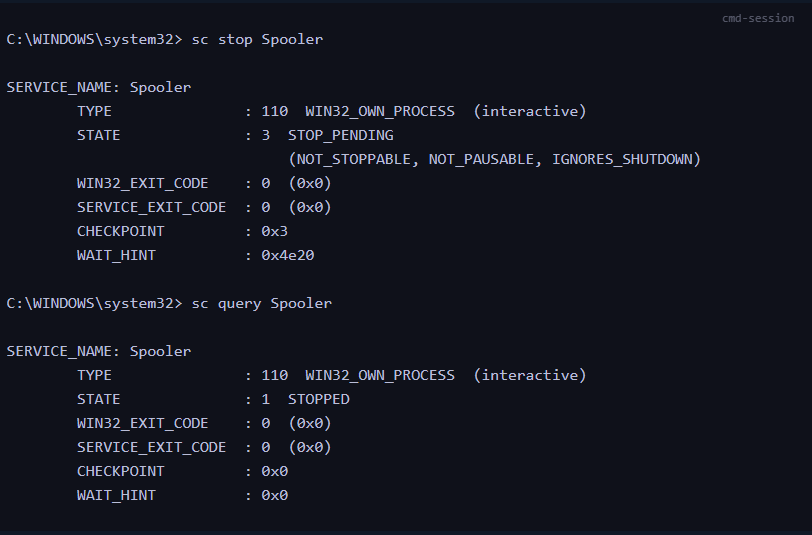

It is important to note that not all services will respond to these requests, regardless of our permissions, especially if other running programs and services depend on the service we are attempting to stop.

Starting a service:
Command: **sc start <name_of_service>**

### Modifying services
You can do alot of things with services, trying to modify existing services to serve the purpose we want them to do. To configure services we must use the config parameters: https://learn.microsoft.com/en-us/windows-server/administration/windows-commands/sc-config in *sc*. We can configure the values regardless if the service is running or not.

All changes made with this command are reflected in the Windows registry as well as the database for Service Control Manager (SCM). All changes to an existing service will only fully update **after restarting the service**.

Note: It is important to be aware that modifying existing services can effectively take them out permanently as any changes made are recorded and saved in the registry, which can persist on reboot. Please exercise caution when modifying services in this manner.

### Example: Taing out Windows Update feature
Windows 10 and above relies on these following services: 
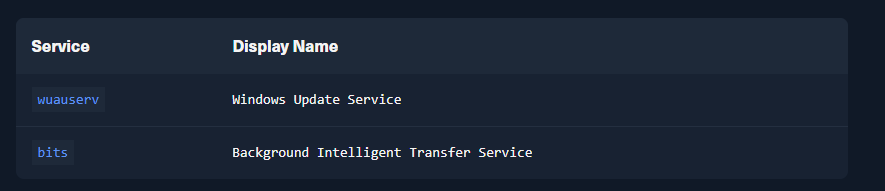

You can see on the picture that wuauserv is not running currently, but the bits are. So we will try to stop it.

Step 1: Query the services
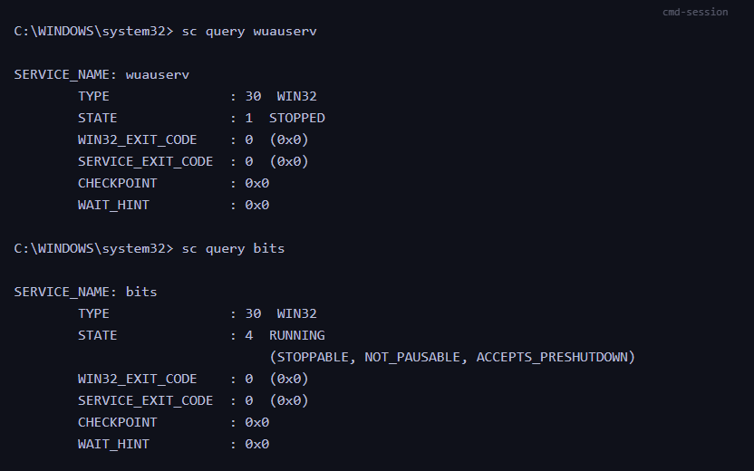

Step 2: Stop the BITS service
Command: **sc stop bits**

Step 3: Modify the start type of both the services
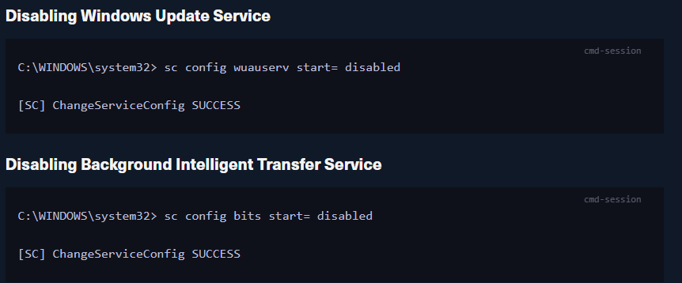

We can see the confirmation that both services have been modified successfully. This means that when both services attempt to start, they will be unable to as they are currently disabled. As previously mentioned, this change will persist upon reboot, meaning that when the system attempts to check for updates or update itself, it cannot do so because both services will remain disabled. We can verify that both services are indeed disabled by attempting to start them.

Step 4: Verifying services are disabled
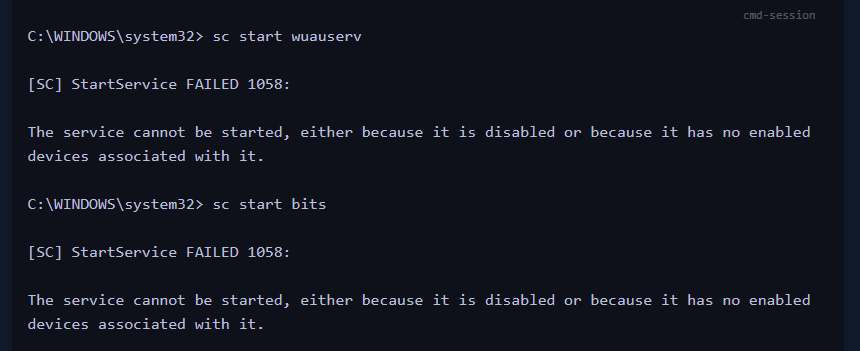

Note: To revert everything back to normal, you can set start= auto to make sure that the services can be restarted and function appropriately.

We have verified that both services are now disabled, as we cannot start them manually. Due to the changes made here, Windows cannot utilize its updating feature to provide any system or security updates. This can be very beneficial to an attacker to ensure that a system can remain out of date and not retrieve any updates that would inhibit the usage of certain exploits on a target system. Be aware that by doing this in this manner, we will likely be triggering alerts for this sort of action set up by the resident blue team. This method is not quiet and does require elevated permissions in a lot of cases to perform.

### Other ways to query services
- Tasklist, a command line tool that gives us a list of currently running processes on a local or remote host.

Providing a list of running services under each process on the system.
Command: **tasklist /svc**

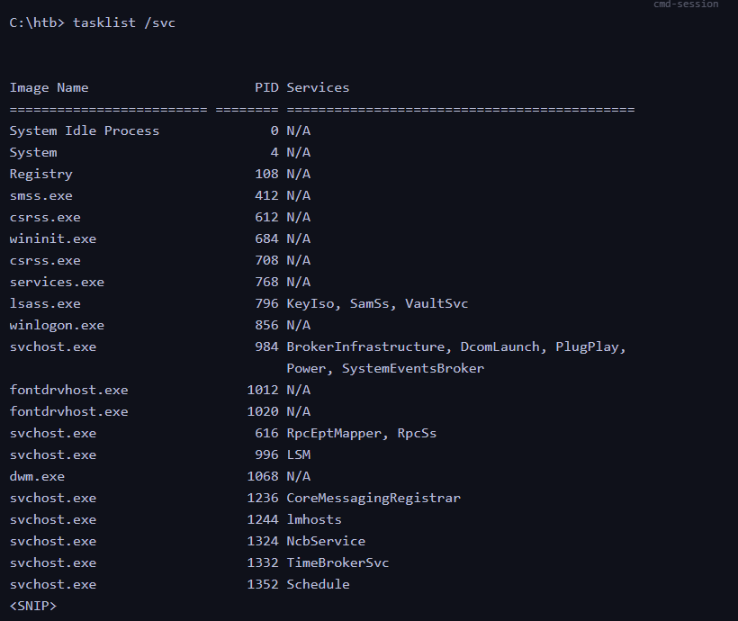

- Net start, command that allows us to list all of the current running services on a system.

Commands: **net start**, **net stop**, **net pause**, **net continue**

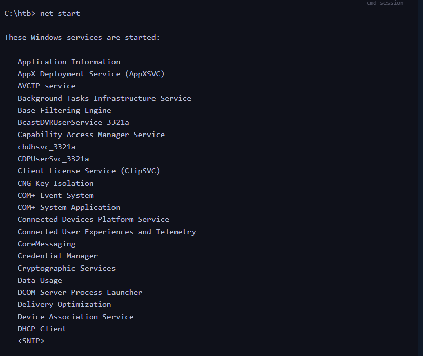

- WMIC, Windows Management Instrumentation Command (WMIC) retrieves a vast range of information from our local host or hosts across the network.

Note: This is a versatile command, alot of other things u can do with it.

To list all services existing on our system and information on them.
Command: **wmic service list brief**

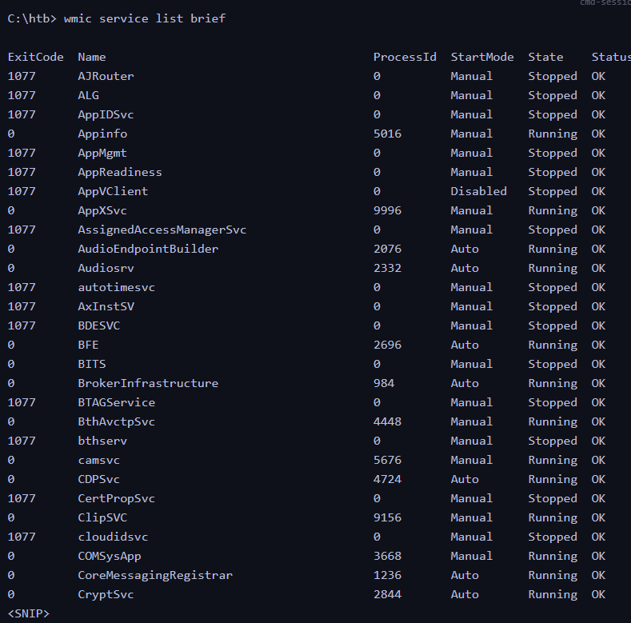

Note: It is important to be aware that the WMIC command-line utility is currently deprecated as of the current Windows version. As such, it is advised against relying upon using the utility in most situations. You can find further information regarding this change by following this: https://learn.microsoft.com/en-us/windows/win32/wmisdk/wmic.

### Question 1
What command string will stop a service named 'red-light'? (full command as the answer)

The answer is "sc stop red-light".

### Question 2
What Windows executable will allow us to create, query, and modify services on a host?

The answer is "sc".

## Working With Scheduled Tasks
Scheduled tasks are an excellent way for administrators to ensure that tasks they want to run regularly happen, but they are also an excellent persistence point for attackers

### What are scheduled tasks?
The Task Scheduler allows us as admins to perform routine tasks without having to kick them off manually. The scheduler will monitor the host for a specific set of conditions called triggers and execute the task once the conditions are met.

**Story Time:** *On several engagements, while pentesting an enterprise environment, I have been in a position where I landed on a host and needed a quick way to set persistence. Instead of doing anything crazy or pulling down another executable onto the host, I decided to search for or create a scheduled task that runs when a user logs in or the host reboots. In this scheduled task, I would set a trigger to open a new socket utilizing PowerShell, reaching out to my Command and Control infrastructure. This would ensure that I could get back in if I lost access to this host. If I were lucky, when the task I chose ran, I might also receive a SYSTEM-level shell back, elevating my privileges at the same time. It quickly ensured host access without setting off alarms with antivirus or data loss prevention systems.*

#### Triggers That Can Kick Off a Scheduled Task
- When a specific system event occurs.
- At a specific time.
- At a specific time on a daily schedule.
- At a specific time on a weekly schedule.
- At a specific time on a monthly schedule.
- At a specific time on a monthly day-of-week schedule.
- When the computer enters an idle state.
- When the task is registered.
- When the system is booted.
- When a user logs on.
- When a Terminal Server session changes state.

### Schtasks command

Display scheduled tasks
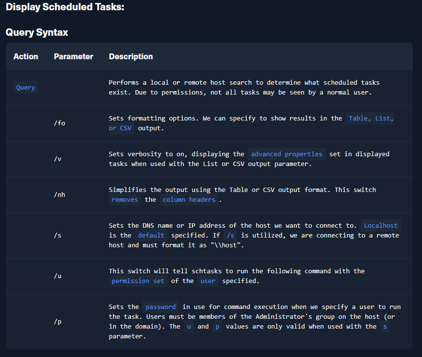

Command: **SCHTASKS /Query /V /FO list**
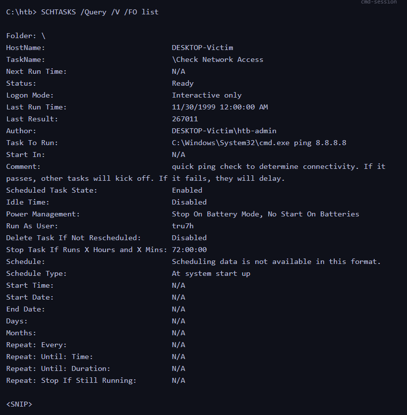

Create new scheduled tasks
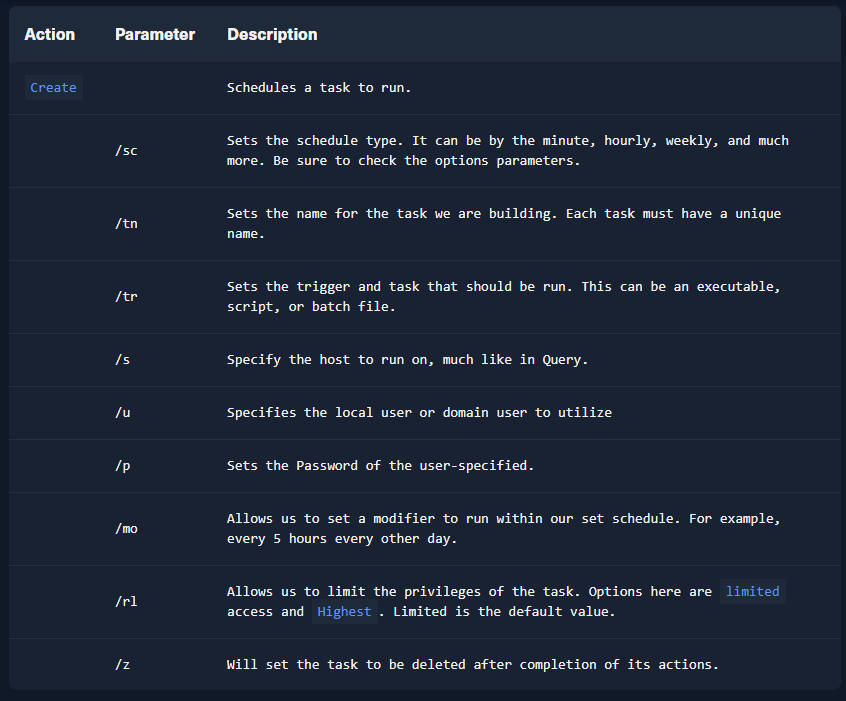

Creating scheduled task, at a minimum specify the following:
- /create : to tell it what we are doing
- /sc : we must set a schedule
- /tn : we must set the name
- /tr : we must give it an action to take

Creation of new task
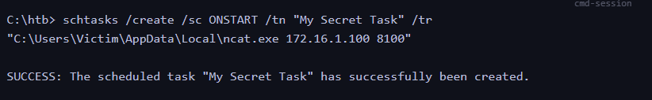

Changing the properties of a scheduled task
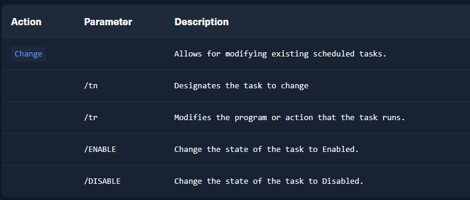

Deleting a scheduled task(s)
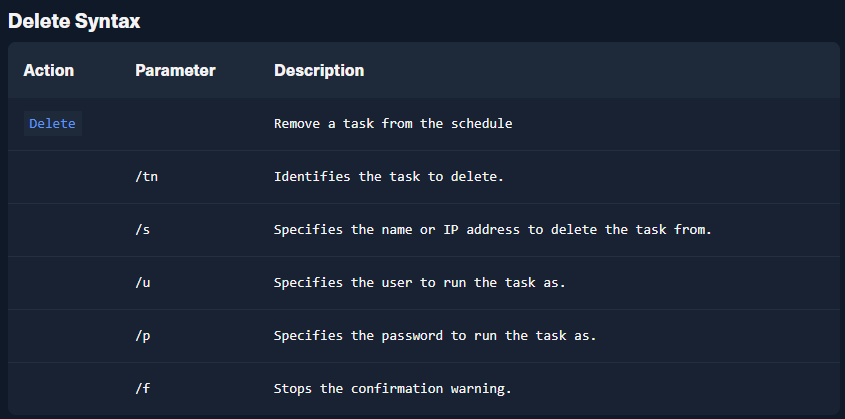

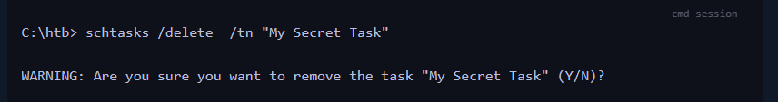
If you use the /F option, u wont be prompted.

### Question 1
True or False: A scheduled task can be set to run when a user logs onto a host?

The answer is "True".

### Question 2
Access the target host and take some time to practice working with Scheduled Tasks. Type COMPLETE as the answer when you are ready to move on.

The answer is "COMPLETE". **Note: The point of this question is to make sure u can create, modify, query and delete schedules. Do not skip this to simply just complete the step.**

# Powershell
The next chapters are about how to use and benefit from Powershell.

## TITLE HERE