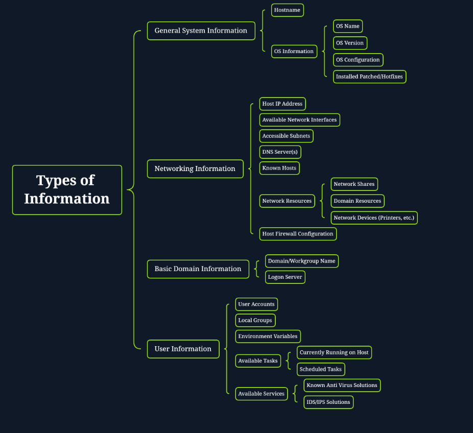
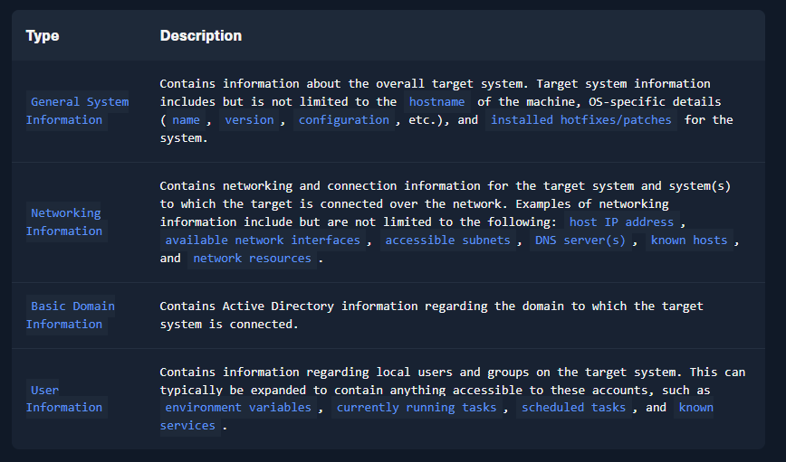
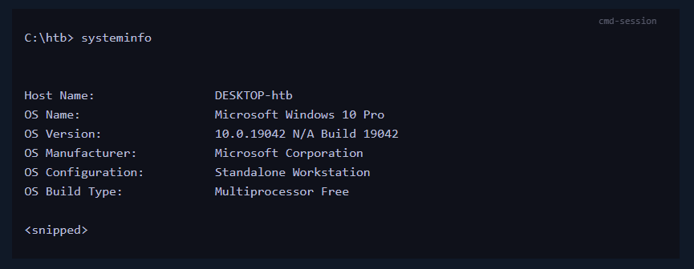

# Windows Command Line

## Command Prompt Basics

Insecure and not recommended:
- Telnet

Better optionals:
- Secure Shell (SSH) 
- PsExec
- WinRM
- RDP

### Case study: Windows Recovery
In the event of a user lockout or some technical issue preventing/ inhibiting regular use of the machine, booting from a Windows installation disc gives us the option to boot to Repair Mode. From here, the user is provided access to a Command Prompt, allowing for command-line-based troubleshooting of the device.

Accessing the Command Prompt via Recovery Mode

While useful, this also poses a potential risk. For example, on this Windows 7 machine, we can use the recovery Command Prompt to tamper with the filesystem. Specifically, replacing the Sticky Keys (sethc.exe) binary with another copy of cmd.exe

Once the machine is rebooted, we can press Shift five times on the Windows login screen to invoke Sticky Keys. Since the executable has been overwritten, what we get instead is another Command Prompt - this time with NT AUTHORITY\SYSTEM permissions. We have bypassed any authentication and now have access to the machine as the super user.

### Question 1
In what directory can the cmd executable be found? (just the folder name as answer)

First we will connect to the target machine by using the following command: ssh htb-student@{IP_ADDRESS}

As you open up the session, you will notice a path in the top of the command line console.

The answer is "system32".

## Getting Help

### Commands:
help
help {COMMAND}
{COMMAND} /?
cls

Command history can be looked at by moving keys up and down, page up, page down and also the command "doskey /history". And if working on a physical Windows host, you can use the function key to interact with session history.

Interrupting commands use Control + C

F3	Will retype the entire previous entry to our prompt.
F5	Pressing F5 multiple times will allow you to cycle through previous commands.
F7	Opens an interactive list of previous commands.
F9	Enters a command to our prompt based on the number specified. The number corresponds to the commands place in our history.

### Question 1
If I wanted to view the help documentation for 'ipconfig', what command and/or modifier would I use? (full command string)

The answer is "ipconfig /?".

### Question 2
What CLI equivalent "Help utility" exists on Linux hosts? (one word)

The answer is "man".

### Question 3
Which CMD hotkey will open an interactive list of the previous commands we have ran?

The answer is "F7".

## System Navigation  
Absolute path - considered the absolute path when it follows the complete structure of the file system starting from the root directory
Example: C:\Users\htb\Downloads

Relative path - using our working directory as the starting point to reference directories either above it or below it in the file system hierarchy.
Example: cd .\Downloads - if your current working directory is C:\Users\htb and we want to change to a directory below our current directory

Move up hierarchy use cd ..\, each ..\ represents a directory, meaning u can be in the Downloads folder and move up to the C folder by simply using the following command: cd ..\..\..\

### Commands:
dir - listing of the directory we are currently working in
cd - our current working directory
chdir
tree - listing the file structure
tree /F - listing the file structure with files and directory

### Interesting Directories
#### Name:	Location:	Description:

%SYSTEMROOT%\Temp	C:\Windows\Temp	    Global directory containing temporary system files accessible to all users on the system. All users, regardless of authority, are provided full read, write, and execute permissions in this directory. Useful for dropping files as a low-privilege user on the system.

%TEMP%	    C:\Users\<user>\AppData\Local\Temp	    Local directory containing a user's temporary files accessible only to the user account that it is attached to. Provides full ownership to the user that owns this folder. Useful when the attacker gains control of a local/domain joined user account.

%PUBLIC%	C:\Users\Public	    Publicly accessible directory allowing any interactive logon account full access to read, write, modify, execute, etc., files and subfolders within the directory. Alternative to the global Windows Temp Directory as it's less likely to be monitored for suspicious activity.

%ProgramFiles%	    C:\Program Files	    folder containing all 64-bit applications installed on the system. Useful for seeing what kind of applications are installed on the target system.

%ProgramFiles(x86)%	    C:\Program Files (x86)	    Folder containing all 32-bit applications installed on the system. Useful for seeing what kind of applications are installed on the target system.

### Question 1
What command will give us a listing of all files and folders in a specified path?

The answer is "tree /F".

### Question 2
What command will print my current working directory onto the console?

The answer is "cd".

## Working with Directories and Files - CMD

### Commands:
md - make new directory
mkdir - make new directory
rd - delete directory
rmdir - delete directory
rd /S - to delete directory and it's content
rmdir /S - to delete directory and it's content
move - move directory and its content from source to destination
xcopy - copies directory and content from source to destination
xcopy {PATH_TO_SOURCE_FOLDER} {PATH_TO_DESTINATION_FOLDER} /E - The /E copies any files and subdirectories to include empty directories, xcopy will reset any attribute the file had. If you want to retain the file's attributes (such as read-only or hidden), u can use /K.

#### xcopy note:
From a hacker's perspective, xcopy can be extremely helpful. If we wish to move a file, even a system file, or something locked, xcopy can do this without adding other tools to the host. As a defender, this is a great way to grab a copy of a file and retain the same state for analysis. For example, you wish to grab a read-only file that was transferred in from a CD or flash drive, and you now suspect it of performing suspicious actions.

robocopy - Robocopy can copy and move files locally, to different drives, and even across a network while retaining the file data and attributes to include timestamps, ownership, ACLs, and any flags set like hidden or read-only

#### robocopy note:
Robocopy can also work with system, read-only, and hidden files. As a user, this can be problematic if we do not have the SeBackupPrivilege and auditing privilege attributes. This could stop us from duplicating or moving files and directories. There is a bit of a workaround, however. We can utilize the /MIR switch to permit ourselves to copy the files we need temporarily.
 
more - view content of a file
more /S - blank space will be downgraded to a single line for easier readability
openfiles
type
echo
fsutil
ren
rename
replace
\> - create file if it doesnt exist or overwrite file if it does
\>> - append to a file
< - pass a for example a text file into a command (find /i "see" < test.txt)
| - pipeline
& - issue command and follow it with another command (ping 8.8.8.8 & type test.txt)
&& - AND
|| - OR
del
erase

#### del/erase note:
if you want to delete a read-only or hidden file, you can use the /A: switch.
To delete read-only file /A:R

u can use the dir /A:R to show all files with Read-only attribute.

removing file: del /A:H * - * is any file
del /F - to force deletion of a directory

copy - copying files from source to destination
copy /V - valdiation that it worked

### Question 1
What command can display the contents of a file and redirect the contents of the file into another file or to the console?

The answer is "type".

### Question 2
What command can be used to make the 'apples' directory? (full command as answer, not the alias)

The answer is "mkdir apples".

## Gathering System Information

Gathering system information aka host enumeration

The goal of host enumeration is to provide a overall picture of the target host, its environment, and how it interacts with other systems across the network.

The first question to ask ourselves is: "How do we know what to look for?"

To answer this question, we need to have a basic understanding of all the different types of information available to us on a system.

During enumeration, ask yourselves these questions:
- What system information can we pull from our target host?
- What other system(s) is our target host interacting with over the network?
- What user account(s) do we have access to, and what information is accessible from the account(s)?

Gathering all the information we can on a system or environment should be prioritized over exploiting the system, to avoid writing the system off as not vulnerable or completetly patched. Take your time gathering all the info needed.

### How to get this information?

#### Casting a Wide Net
Use the command **systeminfo** to find information about the host, such as hostname, IP address(es), domain, hotfixes that have been installed and much more. This is valuable information for a sysadmin when trying to diagnose issues.

For a hacker, this a good way to get a lay of the land while leaving a minimal footprint. Running one command is always better than running multiple commands to get the same information. We are less likely to be detected this way. Gathering information about OS version, hotfixes installed and OS build version can quickly help us determine if the host is vulnerable to an exploit through a Google or ExploitDB search.

#### Systeminfo Output
It's not a good idea to only know one way to gather information, escpially if they are monitored or tracked more closely. That is why we need multiple ways to gather the required information while staying under the radar.

#### Examining the System
#### Hostname Output
#### Ver Output
#### Scoping the Network
#### Ipconfig Without Parameters
#### Utilizing ARP to Find Additional Hosts
#### Understanding Our Current User
#### Checking Out Our Privileges
#### Investigating Groups
#### Investigating Other Users/Groups
#### Net User
#### Net Group/Localgroup
#### Exploring Resources on the Network
#### Net Share
#### Net View
#### Piecing Things Together

### Question 1
What command will output verbose system information such as OS configuration, security info, hardware info, and more?

The answer is "

### Question 2
Access the target host and run the 'hostname' command. What is the hostname?

The answer is "