#Skills Assessment - Windows Fundamentals

##Introduction:
Inlanefreight recently had an incident where a disgruntled employee in marketing accessed an internally hosted HR share and deleted several confidential files & folders. Thankfully, the IT team had good backups and restored all of the deleted data. There are now concerns that this disgruntled employee was able to access the HR share in the first place. After performing a security assessment, you have found that the IT team may not fully understand how permissions work in Windows. You are conducting training and a demonstration to show the department good security practices with file sharing in a Windows environment as well as viewing services from the command line to check for any potential tampering.

##Steps to demonstrate:
1. Creating a shared folder called Company Data

First thing is to connect to the target machine that we are going to make the folder at, this we will do by using the Remote Desktop Protocol (RDP). Connecting via command line on our pwnbox, by using the command:
xfreerdp /v:{IP_ADDRESS_TO_TARGET} /u:{USERNAME} /p:{PASSWORD}

Second thing is to create the folder, this can simply be done by right-clicking for example on the desktop and selecting "New", then "Folder".
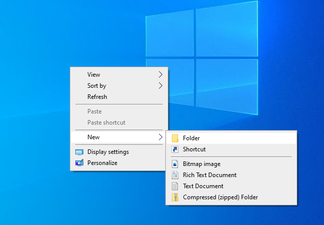
Enabling sharing on the networking via the Advanced Sharing and limiting number of employees to access the shared folder. This is good practice to always set. Setting the limit to 10, however make sure you know how many is needed to access the folder. I am just making an example by setting it to 10.
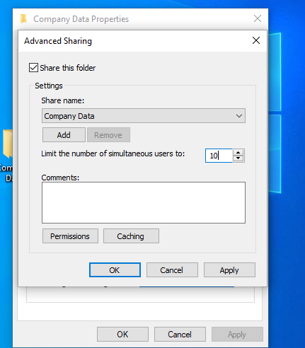
Here you can see the shared path to the folder.
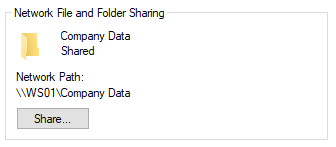

2. Creating a subfolder called HR inside of the Company Data folder

Again making a subfolder within our Company Data folder, is simply just right-clicking again and selecting "New" and then "Folder". Give it a name, and voila. Another folder. Make sure you are located within the Company Data folder, otherwise it wont be a subfolder ;)
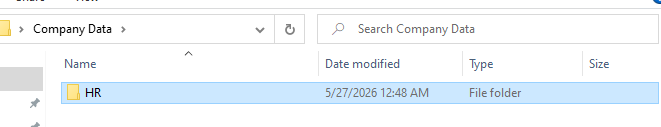

3. Creating a user called Jim
    Uncheck: User must change password at logon

Opening Computer Management which was learned during the module, we can use it to take a look at different folders, users, groups, events, logs. There are tons of information here. However we will make a new user within the "Local Users and Groups/Users" tab.
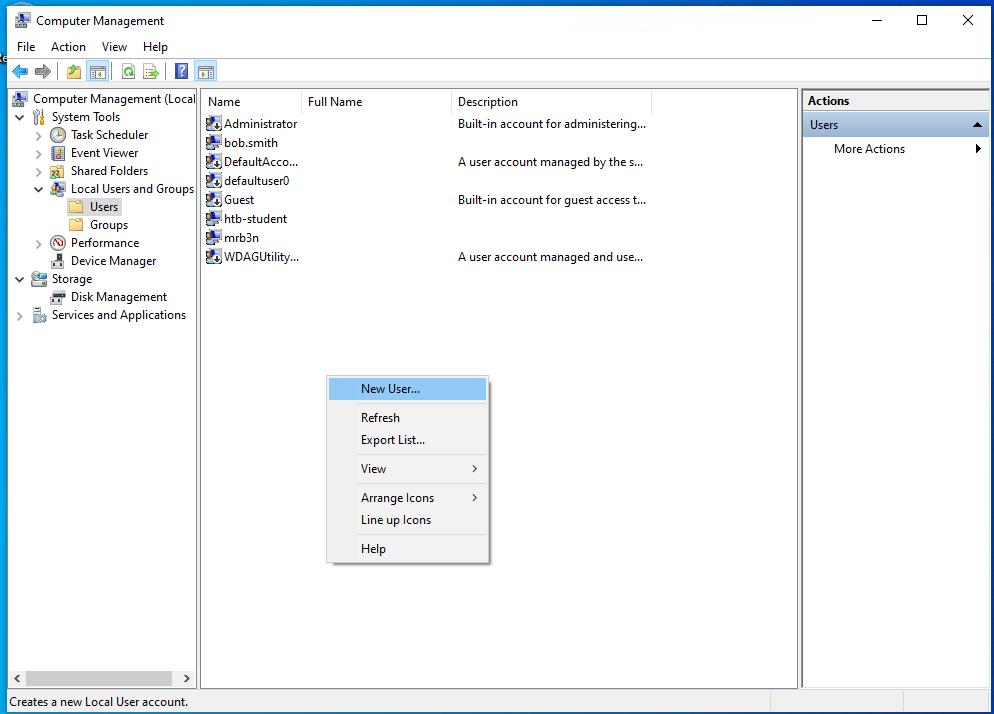

Now we will give the new user a name, fullname, description if needed and other information. One of the criteria for this user is to make sure "User must change password at logon" is not checked. Leave it unchecked.
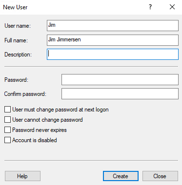

4. Creating a security group called HR

In another tab in the Computer Managment under "Local Users and Groups/Groups", we can make a new group.
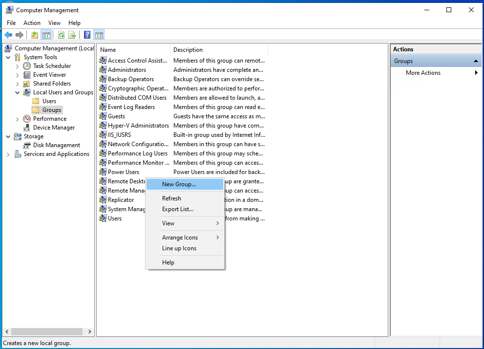

5. Adding Jim to the HR security group

We will add Jim to this security group by clicking "Add", then entering "Jim" and then you can "Check Names" to make sure its the correct user.
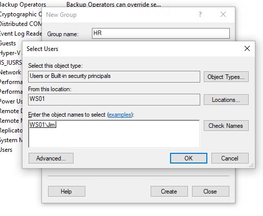

6. Adding the HR security group to the shared Company Data folder and NTFS permissions list
    Remove the default group that is present
    Share Permissions: Allow Change & Read
    Disable Inheritance before issuing specific NTFS permissions
    NTFS permissions: Modify, Read & Execute, List folder contents, Read, Write

Now go back to the "Properties" for the folder Company Data. Open "Permissions" tab under "Advanced Sharing". Here you can see that the default group is "Everyone" and the permission is set to "Read". We will remove this default group, by simply clicking the group and then "Remove".
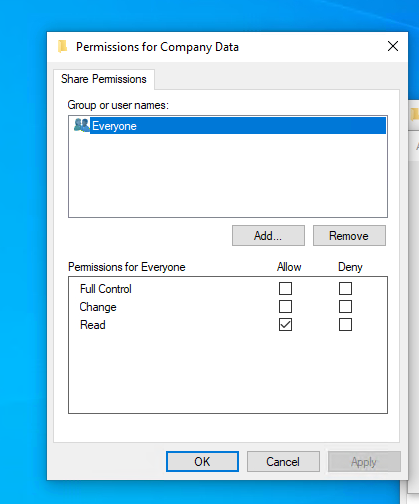

To add the HR security group, simply click "Add" and then type in "HR", click "Check Names" and then the correct group should appear, setting the share permissions to Allow Change and Read.
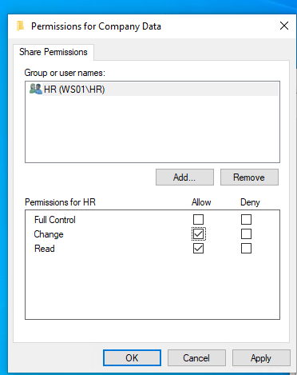

Folders and files inherit the NTFS permissions of their parent folder, this is to save time for administrators, because if you had to set permissions to each folder and file that is created, it would be very time-consuming. However in this case, we want to disable inheritance to make sure we know exactly who has what permissions to the folder. We only want the HR security group and administrator which is us, to have any sort of permission to the Company Data folder. We will start by opening the "Security" tab, then click "Advanced".
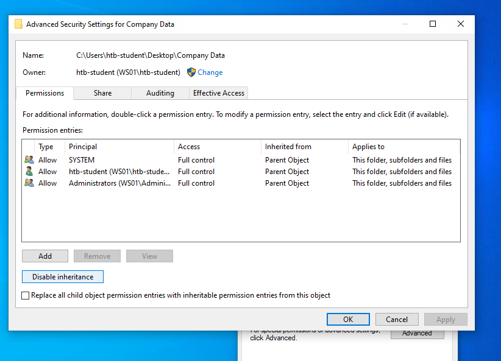

Then click on "Disable inheritance" and choose "Remove all inherited permissions from this object.". This will remove the inherited permissions from the parent folder.
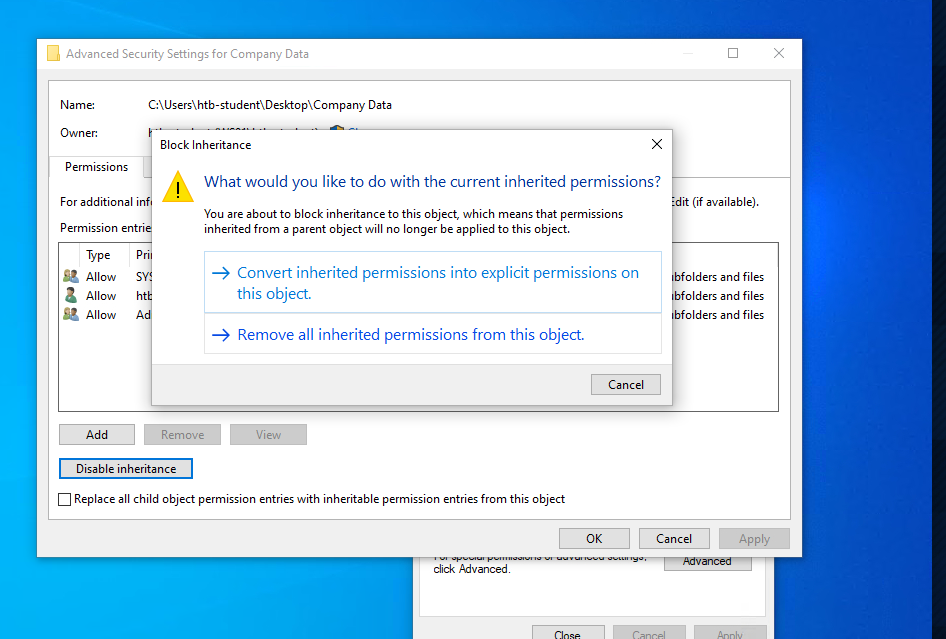

I removed the other users and groups, however in hindsight this was probably not the best idea, because this makes only the "htb-student" user and "HR" group the only group/user of this folder, and the point is probably to make other employees be able to have "Read" rights on the folder atleast. Now add "HR" to the NTFS permissions and set the permissions to Modify, Read & Execute, List folder contents, Read, Write.
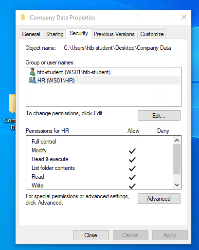

7. Adding the HR security group to the NTFS permissions list of the HR subfolder
    Remove the default group that is present
    Disable Inheritance before issuing specific NTFS permissions
    NTFS permissions: Modify, Read & Execute, List folder contents, Read, and Write

Setting the NTFS permissions for the HR subfolder aswell. It is the same process as mentioned earlier.
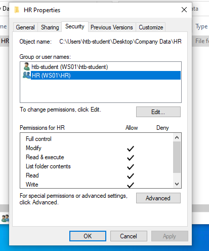

8. Using PowerShell to list details about a service

To list out services in the command line, you can use the Get-Service command, this will display all the services on the machine. To specify what service you can specify with a property followed by name. Here I am displaying the Windows Update service by using the command Get-Service -DisplayName "Windows Update". You can read more about this command on the documentation site for PowerShell here: https://learn.microsoft.com/en-us/powershell/module/microsoft.powershell.management/get-service?view=powershell-7.6. Remember if you are stuck, always start searching on the World Wide Web. This is also a very important tool to practice, finding information on the vast internet.
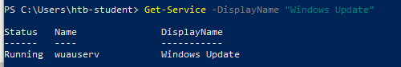

##Questions to answer:

Question 1
What is the name of the group that is present in the Company Data Share Permissions ACL by default?

The Company Data folder’s ACL permissions are shown during step 6. An Access Control List (ACL) is a list of permissions applied to a shared resource, such as a folder. The ACL contains Access Control Entries (ACEs), which define what users or groups are allowed to access the resource and what actions they can perform.

These users and groups are known as security principals and are used to manage and track access to shared resources.

The answer is "Everyone".

Question 2
What is the name of the tab that allows you to configure NTFS permissions?

New Technology File System (NTFS) is the default file system for Windows since NT 3.1 and this question was answered during step 6. NTFS permissions determine what users and groups are allowed to do with files and folders, such as reading, writing, or modifying content.

These permissions are configured through the folder’s ACL and can be managed from the Security tab in the folder properties window.

The answer is "Security".

Question 3
What is the name of the service associated with Windows Update?

Using the command Get-Service, you can list out the service for Windows Update and its relevant information, this is done in step 8.

The answer is "wuauserv".

Question 4
List the SID associated with the user account Jim you created.

By using commands Get-LocalUser and Select-Object, you can query out the spesific name Jim and his SID. 

The reason I have "Select-Object Name,SID", the name queried twice is only because I prefer to list out the name in a neat line then the SID. If you remove the Name parameter in the Select-Object, you will only get the SID for that spesific user. It's just a preference to how you like things listed out in cmd.
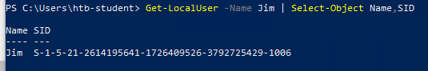

The answer is "S-1-5-21-2614195641-1726409526-3792725429-1006".

Question 5
List the SID associated with the HR security group you created.

With the command Get-LocalGroups and Select-Object, you can query out the spesific name HR and the groups SID. 
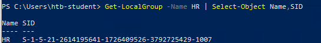

The answer is "S-1-5-21-2614195641-1726409526-3792725429-1007".

##Outcome of assessment:
The purpose of this exercise was to understand how Windows permissions enforce access control and prevent unauthorized actions.

By configuring NTFS permissions through Access Control Lists (ACLs), we were able to control which users and groups could access specific resources. This helps prevent situations where a disgruntled employee could access the HR share when they are not supposed to.